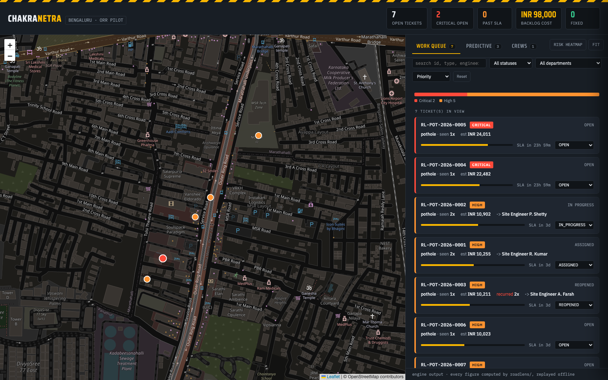
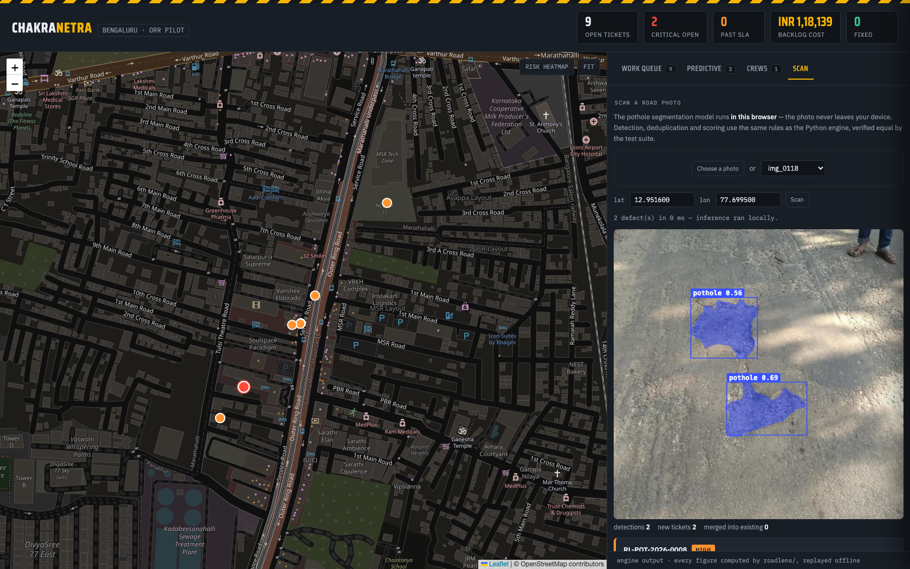
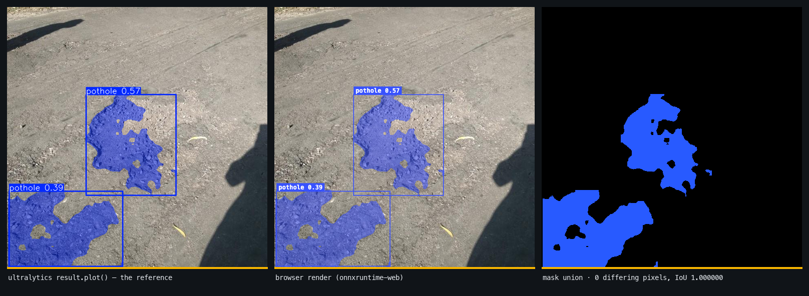
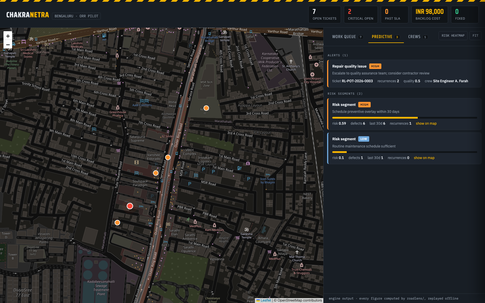
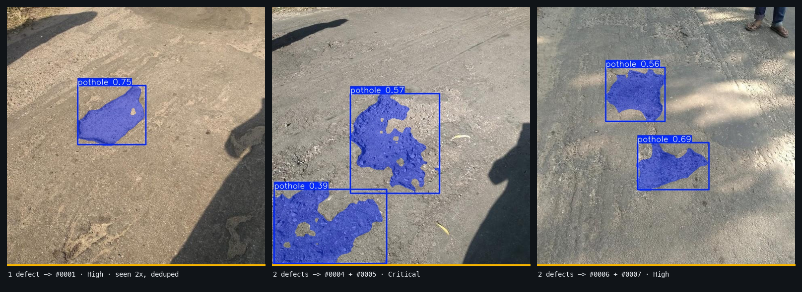

# Chakranetra v2.0

**Every vehicle becomes a road inspector. Every defect becomes an accountable municipal ticket. Every repair is tracked for quality. Problems are predicted before they happen.**

### ▶ [Open the live operations console](https://vijayabaskarr-06.github.io/chakranetra/)

**The model runs in your browser.** Drop a road photo into the
[Scan tab](https://vijayabaskarr-06.github.io/chakranetra/#scan) and YOLOv8-seg
executes on your own machine via ONNX Runtime WebAssembly — no server, no upload,
no API key. The photo never leaves your device.

The console runs on real output from this repository — 7 tickets produced by scanning the
sample trip in `data/samples/`. Pan the map, filter the work queue, move a ticket through
the civic workflow. For live image scanning, run the API locally (see Quickstart below).



*The live console. Seven deduplicated defects plotted along Bengaluru's Outer Ring Road,
coloured by severity — red L4 Critical, amber L3 High, green repaired. Search, filter and
sort the queue; SLA countdowns tick live; click any ticket for its full lifecycle. Status
changes persist across reloads, and every view is deep-linkable
(`#predict`, `#crews`, `#t/RL-POT-2026-0003`).*

### Detection in the browser, scored identically to the server



*A photo scanned client-side: segmentation masks, confidences, and the tickets
that come out of them. This is the same 45 MB YOLOv8s-seg network the Python
pipeline uses, exported to ONNX and run with onnxruntime-web.*



*Left, ultralytics' own `result.plot()`. Centre, the browser's render. Right, the
mask itself. They are not merely similar — the masks are **pixel-identical**:
`IoU 1.000000`, **0 differing pixels**, including the gaps where gravel shows
through the middle of the hole. Equal mask *area* would not have proved this, so
the test compares the masks themselves.*

Duplicating a scoring engine into JavaScript is how demos start lying, so the
port is pinned down by tests rather than trust:

| Check | What it proves |
|---|---|
| `tools/check_onnx_parity.py` | The ONNX graph reproduces **ultralytics** — `area_ratio` delta `0.000000` across the sample set |
| `tests/test_js_inference_parity.py` | `dashboard/scan.js` reproduces the Python post-processing — boxes, confidences and `area_ratio` to `1e-9`, and every mask **pixel for pixel** (0 differing pixels) |
| `tests/test_js_parity.py` | The JS scoring matches `roadlens.severity.assess` on 2 000 random inputs plus every band boundary |
| `tests/test_js_parity.py` | `dashboard/rules.generated.js` is regenerated from `config.yaml`, and CI fails if it goes stale |

A non-square photo is letterboxed to 640×640 for inference, so the overlay is
composited in letterbox space — where the mask is pixel-exact — and then cropped
back to the photo's own aspect ratio. A 960×540 upload renders as 640×360 with no
grey bars, so the highlight lands exactly on the hole in the image you supplied.

One subtlety that mattered: ultralytics crops and thresholds mask **logits**
(`> 0`), not sigmoid probabilities (`> 0.5`). Because sigmoid is non-linear,
applying it before upsampling shifts mask areas by up to `0.0034` of the frame —
enough to move a defect across the `0.060` L4-Critical boundary and file the
wrong ticket. The parity harness caught it.

### Predictive board — the accountability loop closing



*Ticket `#0003` was patched, then two later vehicle passes still detected a defect within
15 m of the repaired spot. The engine recorded both recurrences, dropped the repair-quality
score to 0.5, reopened the ticket and raised a repair-quality alert against the crew — no
human filed any of that. Risk segments come from the same pass: a 500 m stretch carrying six
defects scores 0.59 and earns a preventive-overlay recommendation before anyone complains.*

### What the model actually sees



*Real YOLOv8-seg output on `data/samples/`, written to `output/` by `python run_demo.py`.
Pixel masks rather than boxes, because a pothole is round-ish and a box always over-counts
its area — and area is what drives the severity band. Left: one defect seen on both
simulated vehicle passes, merged into a single ticket that gets **stronger**, not
duplicated. Centre: two separate holes in one frame, correctly kept apart by the
same-frame separation rule, both scoring L4 Critical.*

Chakranetra takes ordinary dashcam or CCTV footage, finds road infrastructure defects
(potholes today; cracks, broken footpaths, missing zebra crossings next), and converts
each *unique physical defect* into a routed, costed, SLA-tracked ticket for the
municipal road department — closing the loop the problem statement asks for:

> *issue detected → ticket created → routed to department → assigned to site engineer → fixed → verified → monitored for recurrence*

India's Ministry of Road Transport & Highways attributes thousands of road deaths in
recent years to pothole-related accidents. Cities don't lack the will to fix roads —
they lack a **trustworthy, deduplicated, prioritized list of what is broken, where,
and how urgent it is**. That list is what Chakranetra produces, automatically, from
vehicles that are already driving the roads anyway.

---

## Why this is different from "a model that draws boxes on potholes"

Most computer-vision demos stop at detection. Detection alone is useless to a city.
Chakranetra is built around the problems that actually break real deployments:

### 1. Deduplication — the killer problem
A dashcam at 30 fps sees the same pothole in ~40 consecutive frames. Tomorrow, three
more vehicles drive past it. A naive system files 160 tickets for one hole, and the
municipal officer stops trusting the dashboard on day one. Chakranetra merges every
sighting of the same physical defect (GPS clustering via haversine distance, with a
same-frame separation rule so two adjacent potholes are never wrongly merged) into
**one ticket that gets *stronger* with each sighting** — more sightings means higher
confidence and higher priority, not more noise.

### 2. Prioritization a city can defend
Every ticket carries a severity level (L1–L4), a 0–100 priority score, an estimated
repair cost, an SLA deadline, and a department route. The scoring is deliberately
plain arithmetic, not a black box — rules that direct public money must be explainable
to a commissioner in one sentence. All thresholds live in `config.yaml` for easy tuning.

### 3. Accountability, both directions
Tickets move through `OPEN → ASSIGNED → IN_PROGRESS → FIXED → VERIFIED`. The
`VERIFIED` step is the honest part: when a later vehicle pass no longer detects the
defect at that location, the *same AI that reported the problem confirms the fix*.
No self-reported paperwork. And if a later scan still sees it → `REOPENED`.

### 4. Predictive Recurrence Prevention (NEW in v2.0)
This is the feature that **prevents problems from coming back**:

- **Recurrence Tracking**: When a defect reappears at a previously fixed location, Chakranetra automatically flags it, tracks how many times it has recurred, and calculates a repair quality score for the assigned crew.
- **Repair Quality Scores**: Each crew gets a quality score based on how often their repairs hold up. Crews with consistently low scores are flagged for retraining.
- **Risk Heatmaps**: Chakranetra identifies road segments with historically high defect density so cities can schedule preventive resurfacing BEFORE new holes form.
- **Predictive Alerts**: When a road segment crosses the recurrence threshold, the system raises a preventive-maintenance alert on `/api/predictive/alerts` BEFORE citizens complain, with the recommended action and an estimated preventive cost.

This transforms Chakranetra from a reactive patching system into a **preventive maintenance platform**.

### 5. Production-Ready Infrastructure (NEW in v2.0)
- Structured JSON logging for every operation
- Configuration management via YAML or environment variables
- Input validation and error handling on all API endpoints
- Docker & Docker Compose support
- CI/CD pipeline with GitHub Actions
- Comprehensive test suite with pytest

---

## What's in the box

```
chakranetra/
├── run_demo.py                ← one command, full pipeline, no API keys, CPU-only
├── config.yaml                ← all tunable parameters in one place
├── Dockerfile                 ← production-ready container
├── docker-compose.yml         ← one-command deployment
├── roadlens/
│   ├── detector.py            YOLOv8 segmentation inference (images + video)
│   ├── geo.py                 GPS attach: GPX interpolation / manual (citizen app)
│   ├── dedup.py               sighting → unique-defect clustering
│   ├── severity.py            severity, priority, cost, SLA, dept routing
│   ├── tickets.py             SQLite ticket registry + lifecycle + recurrence
│   ├── predictive.py          recurrence tracking, risk heatmaps, crew scores
│   ├── config.py              configuration management (YAML + env vars)
│   ├── logger.py              structured JSON logging
│   └── ml/                    ← Chakranetra's OWN models (not pretrained)
│       ├── gbt.py             gradient-boosted trees, written out in NumPy
│       ├── features.py        one feature definition, shared by train + serve
│       ├── models.py          cost / degradation / repair-failure / budget
│       ├── bootstrap.py       labelled synthetic corpus, for demo only
│       └── registry.py        train, save, load, and provenance
├── server/app.py              FastAPI: scan upload API + ticket API + predictive API + dashboard
├── dashboard/index.html       municipal road-operations console (map + work queue)
├── data/samples/              real road photos (pothole-segmentation dataset)
├── data/demo_route.gpx        demo dashcam GPS track (Bengaluru ORR)
├── models/                    trained model weights, as plain JSON
├── tools/
│   ├── train_models.py        `make train` — fits the models, prints the metrics
│   ├── generate_ml_js.py      exports the cost model for the browser
│   └── generate_rules_js.py   exports the severity rules for the browser
├── tests/                     comprehensive test suite
├── .github/workflows/ci.yml   CI/CD pipeline
└── docs/ARCHITECTURE.md       data flow, module boundaries, design decisions
```

## Quickstart (3 commands)

```bash
pip install -r requirements.txt
python run_demo.py                 # full pipeline on real images, ~1 min on CPU
uvicorn server.app:app             # → open http://127.0.0.1:8000
```

`run_demo.py` downloads the pretrained pothole segmentation model once
(`keremberke/yolov8s-pothole-segmentation`, cached afterward), scans the sample trip,
deduplicates across two simulated vehicle passes, files tickets, demonstrates the
predictive recurrence engine, and exports data so `dashboard/index.html` also works
standalone — just double-click it.

### Docker Quickstart

```bash
docker compose up --build
# → open http://127.0.0.1:8000
```

---

## The API

| Endpoint | What it does |
|---|---|
| `POST /api/scan/image` | photo + lat/lon → detect → dedup → ticket(s) + annotated evidence; also re-opens a recently-repaired ticket if the defect is back |
| `GET /api/tickets` | work queue, sorted by priority (filter by status / department) |
| `GET /api/tickets/{id}` | single ticket with full history |
| `POST /api/tickets/{id}/status` | move a ticket through the civic workflow |
| `GET /api/stats` | commissioner's numbers: open, critical, past-SLA, backlog, recurrences |
| `GET /api/predictive/alerts` | predictive maintenance alerts & repair quality issues |
| `GET /api/predictive/heatmap` | risk heatmap data for visualization |
| `GET /api/predictive/crews` | crew performance scores |
| `GET /api/predictive/segments` | computed risk segments |
| `POST /api/tickets/{id}/cost` | record what a repair **actually** cost — the label the cost model learns from |
| `GET /api/ml/status` | which models are trained, on what data, and how they scored |
| `GET /api/ml/cost/{id}` | predicted repair cost, with a conformal interval and a per-feature explanation |
| `GET /api/ml/forecast/{id}` | days until this defect reaches the next severity band |
| `GET /api/ml/failure/{id}` | probability this repair fails and the defect returns |
| `GET /api/ml/budget` | 30/60/90-day spend forecast with a simulated band |
| `GET /` | the road-operations dashboard |

Interactive docs are auto-generated at `/docs`.

---

## How severity works (fully transparent)

| Level | Meaning | Frame area | SLA | Base cost |
|---|---|---|---|---|
| L4 Critical | accident risk now | ≥ 6% | 24 h | 18,000 |
| L3 High | two-wheeler hazard | ≥ 2.5% | 72 h | 9,000 |
| L2 Medium | forming, will grow | ≥ 0.8% | 7 d | 4,500 |
| L1 Low | surface wear | any | 14 d | 1,800 |

Priority (0–100) = size (up to 60) + model confidence (up to 25) + repeat sightings
(up to 15). Every constant is documented in `config.yaml` and tunable per city.

---

## Predictive Engine — How It Prevents Problems

### Recurrence Tracking Flow
1. When a ticket is marked `FIXED`, Chakranetra registers it for monitoring (90-day window by default).
2. If a later scan detects a defect within 15 m of the original location, a recurrence is recorded against the *original* ticket, that ticket moves to `REOPENED`, and the new sighting still gets its own ticket. Matching is by location, not by ticket id — a defect that comes back is always detected as a brand-new sighting.
3. Each recurrence reduces the repair quality score by 25%.
4. At 2+ recurrences: "high" severity alert, full-depth repair recommended.
5. At 4+ recurrences: "critical" alert, contractor review triggered.

### Risk Heatmap
Chakranetra divides the city into a grid and computes a risk score for each cell based on:
- Defect frequency in the last 30 days (40% weight)
- Total historical defect density (30% weight)
- Recurrence rate (30% weight)

Segments scoring above 0.85 trigger immediate preventive resurfacing recommendations.

### Crew Performance
Each crew gets an average quality score across all their monitored repairs:
- 0.9–1.0: Excellent
- 0.7–0.9: Good
- 0.5–0.7: Needs improvement
- Below 0.5: Requires retraining

---

---

## Chakranetra's own models

The detector is somebody else's network — a pretrained YOLOv8-seg, and the README
says so. Everything in `roadlens/ml/` is this project's own: four models built on a
gradient-boosted-tree learner written out in NumPy, trained here, and tested here.

| Model | Predicts | Beats |
|---|---|---|
| `CostModel` | rupee cost of a repair, with a 90% interval | the rules engine, by **65% lower held-out MAE** |
| `DegradationModel` | days until a defect reaches the next severity band | the fleet-average growth rate, by **22%** |
| `RepairFailureModel` | P(this repair fails and the defect returns) | the base rate — **AUC 0.72**, lower Brier |
| `BudgetForecast` | ward-level 30/60/90-day spend, with a band | — composes the two above |

### They correct the rule, they do not replace it

`severity.py` argues that arithmetic deciding public spending must be explainable,
and it is right. So the cost model does not predict cost. It predicts
`log(actual) − log(rules_estimate)` — the *correction* to the rule — which has three
consequences that fall out for free:

- **Cold start is exact, not approximate.** An ensemble with zero trees returns the
  rules estimate to the last rupee. A city that has recorded no invoices sees exactly
  today's behaviour, and `source: "rules"` on every response saying why.
- **Predictions cannot go negative,** and the interval is multiplicative — ±26%,
  not ±₹4,000. Repair-cost error scales with cost; a fixed rupee band is absurdly
  wide on a hairline crack and absurdly tight on a highway cavity.
- **`explain()` reads as percentages off the rule**, with one-hot columns summed
  back into the field they came from — `road_class = highway  +81.8%` is a sentence
  a municipal officer can check against their own experience. (Attributing that
  credit to the individual column a tree happened to split on is technically
  accurate and reads as nonsense: on a highway ticket it prints
  `road_class=residential`, because the split is testing *not residential*.)

What the model learns that the rule *cannot express* is the point. The rules engine
prices a defect from its size alone, so it returns the same number for the same hole
on a national highway and a residential lane. The model prices them **2.9× apart**
(₹20,641 against ₹7,230, off an identical ₹10,800 rule), because highway work needs
lane closure, night working and a heavier mix. That gap is a test:

```python
def test_cost_model_learns_the_road_class_effect_the_rule_cannot_express(registry):
    assert highway["rules_inr"] == residential["rules_inr"]      # the rule cannot tell
    assert highway["predicted_inr"] > residential["predicted_inr"] * 1.5
```

### A model that cannot beat the rule does not get to serve

Every `train()` scores itself against the baseline it would replace, on data it never
saw, and **refuses to install itself if it is not better**. `tests/test_ml_models.py`
proves the gate fires: given repair costs that are the rules estimate times pure
noise, a 300-tree ensemble will happily learn the noise, and training rejects it —
`status: "rejected_not_better_than_rules"`, and every prediction falls back to
arithmetic. A learned model quietly worse than the formula it replaced is the most
expensive failure mode here, and it is silent unless something checks.

### The intervals are calibrated, and the calibration is measured

Cost predictions carry **split-conformal** intervals: given exchangeable data they
cover the true cost at the stated rate with no assumption about the error
distribution. That is a claim, so it is tested — at three levels, on tickets the
model never saw:

```
tests/test_ml_models.py::test_conformal_intervals_cover_at_their_stated_rate
    alpha=0.05  →  coverage ≥ 0.95 − slack
    alpha=0.10  →  coverage ≥ 0.90 − slack
    alpha=0.20  →  coverage ≥ 0.80 − slack
```

The budget forecast's band comes from a Monte Carlo over those intervals rather than
from summing them, because summing assumes every ticket is wrong in the same
direction at once. Its two extra assumptions — lognormal errors, independent across
tickets — are returned in the API response, in an `assumptions` array.

### The training data is labelled, always

**The models ship trained on synthetic data, and say so everywhere.** This repository
contains no real repair invoices, so `roadlens/ml/bootstrap.py` generates a simulated
city from a documented process, and a model fit to it is stamped
`training_data: "synthetic_bootstrap"` — in the model JSON, in every API response, in
the browser bundle, and as a red badge across the dashboard's Budget tab reading
*"no figure here should be quoted as if they did"*. There is no configuration that
makes it look real.

A model trained there can only rediscover the process that generated it. It
demonstrates that the machinery works. It says nothing about Bengaluru's actual
repair costs.

The moment a city posts real invoices to `POST /api/tickets/{id}/cost` and re-runs
`make train`, the registry trains on those instead and the label flips to `observed`.
That switch is also a test.

### The cost model runs in the browser, and is pinned there

The console already runs YOLOv8-seg client-side. A cost estimate that had to
round-trip to a server would break that promise and leave the hosted GitHub Pages
console showing nothing, so the ensemble ships as JSON and evaluates in the browser —
and is held to the same standard as the severity rules:

| Check | What it proves |
|---|---|
| `tests/test_ml_js_parity.py` | `dashboard/ml.generated.js` reproduces `roadlens.ml.CostModel` on 1 500 random tickets — rupees, interval bounds and the raw log-scale score to `1e-9` |
| `tests/test_ml_js_parity.py` | Severity-band boundaries and all twelve months agree (`getUTCMonth()` is 0-based; Python's `.month` is not) |
| `tests/test_ml_js_parity.py` | The bundle is regenerated from the trained model, and CI fails if it goes stale |
| `tests/test_dashboard_budget.py` | The Budget panel's own source, executed under node: renders offline, escapes ticket ids, and discloses a synthetic model |

Only the cost model is exported. Degradation and repair-failure need a defect's
sighting history and a crew's repair record — data the browser does not have and
should not be handed — so those stay server-side.

### Training it

```bash
make train          # fits all three models, regenerates the browser bundle
```

```
====================================================================
  TRAINED ON SYNTHETIC DATA — demonstration only
====================================================================
cost         model_mae_inr 867   rules_mae_inr 2465   improvement 64.8%
degradation  model_mae 0.0057    constant_mae 0.0074  improvement 22.5%
failure      auc 0.7221          brier 0.2014         base_rate_brier 0.2263
```

### One bug this found on the way in

The degradation model needs two sightings of *one* defect to measure growth. It could
never have had them: `cluster_detections` deduplicates within a single scan, but the
scan endpoint called `create_from_cluster` unconditionally, so re-scanning a road
tomorrow filed a **second ticket for the same pothole** — duplicates in the queue, and
no ticket ever accumulating a second observation. `TicketStore.find_open_at_location`
now matches a cluster to the open ticket already covering that defect and appends to
its growth history instead, revising the ticket's size and severity upward only
(`/api/scan/image` reports these as `tickets_updated`).

---

## Configuration

All tunable parameters are in `config.yaml`:

```yaml
detector:
  confidence_threshold: 0.35
  video_sample_every_n_frames: 15

dedup:
  merge_radius_meters: 12.0

predictive:
  recurrence_radius_meters: 15.0
  monitoring_window_days: 90
  high_recurrence_threshold: 2
  critical_recurrence_threshold: 4
  heatmap_grid_size_km: 0.5

log_level: INFO
```

Environment variables are layered **on top of** `config.yaml`, so they win:
```bash
export ROADLENS_CONFIDENCE=0.5
export ROADLENS_MERGE_RADIUS=15
export ROADLENS_RECURRENCE_RADIUS=20
export ROADLENS_LOG_LEVEL=DEBUG
export ROADLENS_LOG_FORMAT=text
export ROADLENS_DB_PATH=/data/roadlens.db
```

---

## Running Tests

```bash
pytest tests/ -v --cov=roadlens --cov-report=term-missing
```

The JavaScript parity tests need `node` on the path and a trained model in `models/`;
without either they skip rather than fail, so CI without node still passes. Run
`make train` first to exercise them.

---

## Honest limitations (and the plan for each)

- **The models ship trained on synthetic data.** This repository has no real repair
  invoices, so `roadlens/ml/bootstrap.py` supplies a simulated city and every
  prediction derived from it is labelled `synthetic_bootstrap` in the API, the
  browser bundle and the dashboard. The machinery is real and tested; the *numbers*
  become meaningful only once a city posts real costs to
  `POST /api/tickets/{id}/cost` and re-runs `make train`.
- **The rules-engine cost baseline still uses a calibration constant**, not measured
  metres. Production calibrates per m² per road class from the camera geometry. The
  learned cost model corrects that baseline rather than replacing the need to
  calibrate it.
- **`road_class` is a ticket field, not something the vision model infers.** It is the
  cost model's strongest feature, and today it defaults to `arterial` unless a city
  supplies it. Joining tickets against an existing road-network layer is the obvious
  next step and needs no model change.
- **The bundled model detects potholes only.** The detector is a plug-in behind one
  interface — training YOLOv8 on a multi-class dataset extends coverage with zero
  changes elsewhere; department routing for those classes is already wired.
- **GPS dedup radius (12 m) is a heuristic** chosen for consumer GPS error. Dense
  urban deployments can add visual re-identification as a second merge signal.
- **SQLite is a pilot database.** Single-writer is fine for one city ward; the
  `TicketStore` interface swaps to Postgres unchanged at scale.
- **The recurrence/heatmap engine in `predictive.py` is still rules-based**, and
  deliberately stays that way — those thresholds are what a city argues about in a
  council meeting. The learned models in `roadlens/ml/` layer on top of it rather
  than replacing it, and each one falls back to the rule when it cannot do better.
- **The degradation model needs history that a new deployment does not have yet.**
  It trains on pairs of sightings of the same defect, so a city gets its first
  forecast after a road has been driven twice, weeks apart — not on day one.

---

## Where this goes

Ward-level pilot with municipal garbage trucks and buses (they already cover every
street weekly) → citizen photo reporting through the same `/api/scan/image` endpoint →
integration with existing municipal grievance systems → a public transparency map so
residents see the same queue the city sees → **predictive maintenance scheduling that
fixes roads before they break**.

---

*Built as a complete, working system — every number in this README comes from actually
running the code in this repository. v2.0 adds predictive analytics, recurrence
prevention, structured logging, configuration management, Docker support, CI/CD,
and a comprehensive test suite.*
